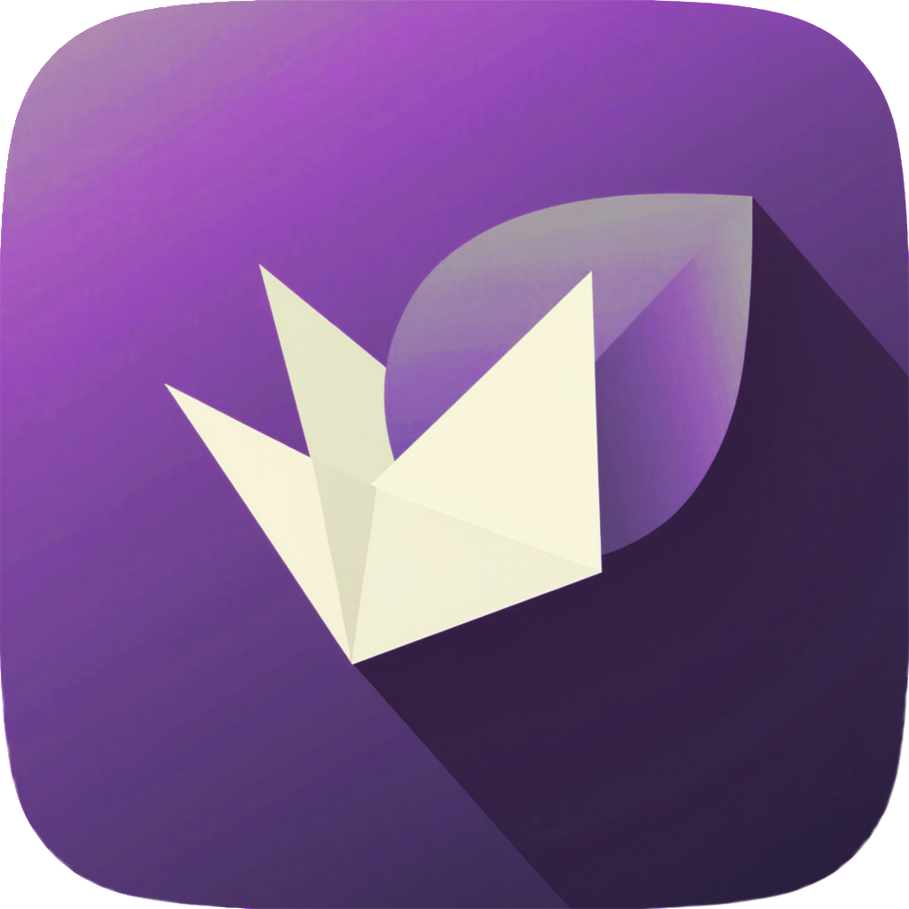
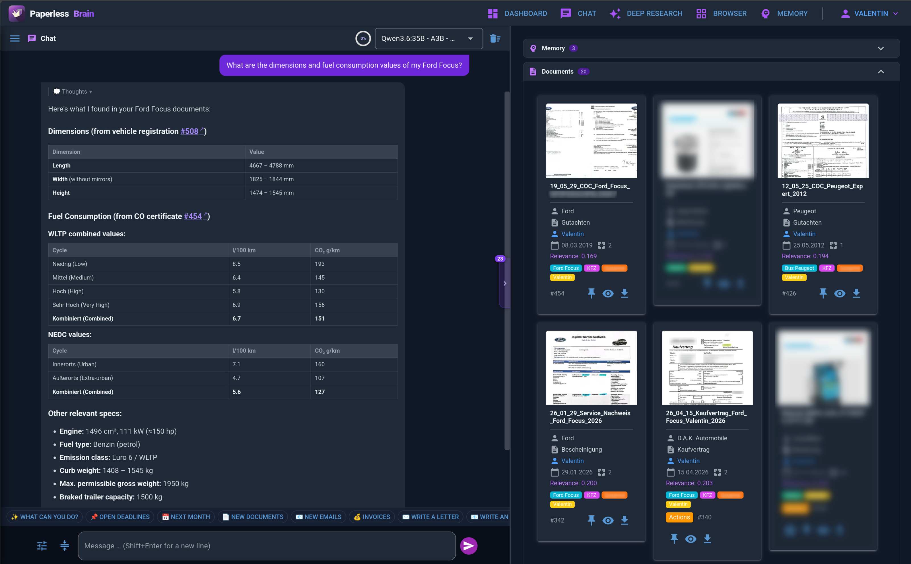
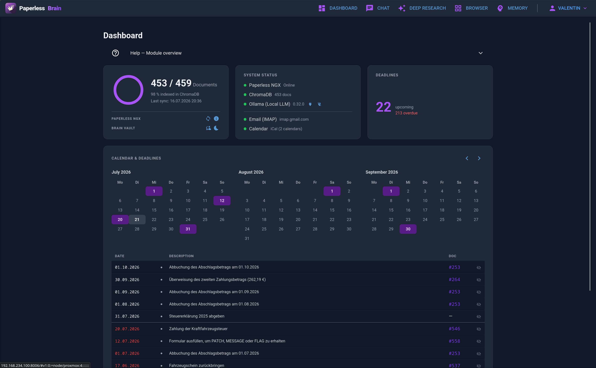
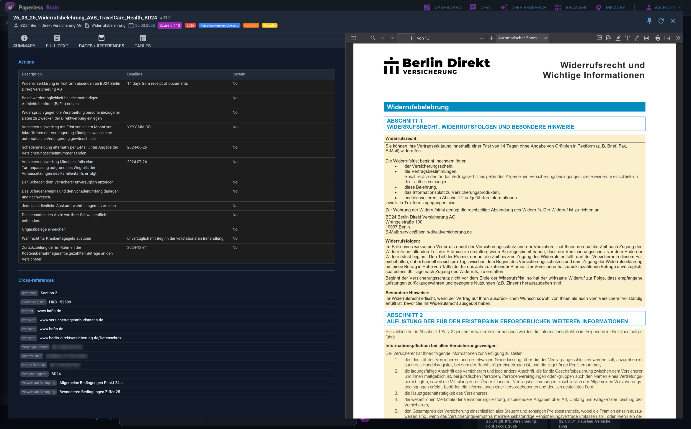
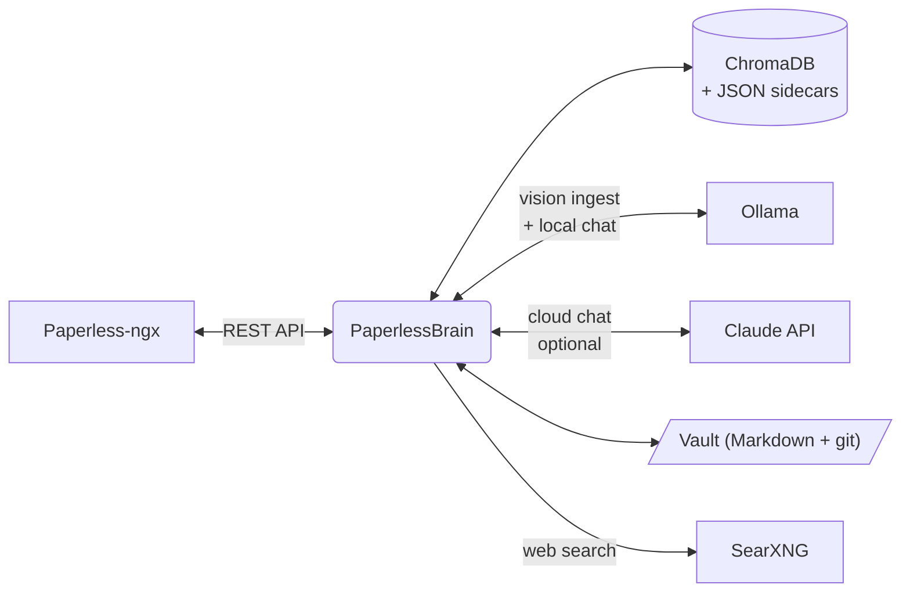

<p align="center">
  
</p>

<h1 align="center">PaperlessBrain</h1>

<p align="center"><b>The brain for your <a href="https://docs.paperless-ngx.com/">Paperless-ngx</a> archive.</b><br>
Chat with your documents, let a vision LLM read every page, never miss a deadline.<br>
Installable PWA — built for mobile and desktop.</p>

<p align="center">
  
  
  
  <a href="https://nicegui.io/"></a>
</p>

<p align="center">
  
</p>

---

> **Status and expectations.** This is a personal homelab project, shared as-is because it
> might be useful to someone else. It's alpha, it has rough edges, and I'm not a full-time
> maintainer — issues and PRs get answered when I have time.
>
> I'd rather this grew into one good app than five half-finished ones, so if something is
> missing, broken or awkward, please open an issue or a PR here. Good work gets merged, and if
> you want a larger role than that, just ask. It's MIT — you're free to fork, but I'd much
> rather build it with you.

## What it does

Paperless-ngx stores and organizes your documents. PaperlessBrain reads them —
every page, through a vision LLM — and turns the archive into something you can
talk to.

- **Chat with your archive** — an agentic tool loop (Claude API or your local
  Ollama models) that searches, reads, cross-references and cites your documents.
- **Vision-LLM ingestion** — each page is rendered to an image and read by a
  local vision model: full-text summary, tables, actions and deadlines, extracted
  per document type. No cloud required for ingestion.
- **Deadlines & actions** — extracted obligations ("cancel by …", "pay until …")
  surfaced on the dashboard.
- **Brain memory** — the assistant remembers facts about you as plain Markdown
  files, embedded for recall in every conversation.
- **Vault notes** — your own Markdown knowledge base, searchable in chat
  alongside the archive. Works with any editor; Obsidian optional.
- **Deep research** — autonomous multi-step research, but the kicker is the data
  source: the agent researches across **your own documents** alongside the web. A
  deterministic orchestrator splits a job into sub-tasks, runs scoped agents, and
  synthesizes a reviewed result.
- **Document generation** — DIN-5008 letters (German market), email drafts,
  chat-to-PDF saved back into Paperless.
- **Email & calendar tools** — per-user IMAP and CalDAV credentials, encrypted;
  the assistant can check mail and appointments when you ask.
- **Web search** — via your self-hosted SearXNG instance, with full-page
  reading (trafilatura, optional headless Chromium for JS-heavy pages).
- **PWA** — installable on phone and desktop, per-user language (English/German),
  dark/light theme.

## Why I built this

This is a small project I built for my own document system. In early 2026 I
tried several existing tools and none fit my needs — for what I wanted they were
missing the advanced parts: using high-end consumer hardware effectively, a more
detailed LLM ingestion, an information-rich vector database, and genuinely useful
document detail views. It grew feature by feature and is now feature-complete
enough that it feels worth sharing with the community.

My best personal results have been with **Qwen3.6-35B-A3B (MTP, Q4)** as the chat
model — Multi-Token Prediction makes it faster than any cloud model I've tried,
while staying really strong at tool use. Your mileage will vary with your own
hardware and models; nothing here is tied to a specific one.

## Screenshots

<table>
  <tr>
    <td width="50%"><br><sub><b>Dashboard</b> — deadlines & actions extracted from every document</sub></td>
    <td width="50%"><br><sub><b>Document detail</b> — vision-read pages, tables, actions, cross-references</sub></td>
  </tr>
  <tr>
    <td colspan="2"><br><sub><b>Deep research</b> — autonomous multi-step research, reviewed before persist</sub></td>
  </tr>
</table>

## Architecture



Sync compares Paperless against the index, new documents are rendered page by
page and read by the vision model; results live in JSON sidecars plus ChromaDB
embeddings (`multilingual-e5` — multilingual retrieval). The chat backends
(Claude / Ollama) share one tool set and one streaming event protocol.

## Quick start (Docker)

```bash
git clone https://github.com/Vailsen/paperless-brain && cd paperless-brain
cp .env.example .env      # fill in: PAPERLESS_URL, PAPERLESS_SUPERUSER_TOKEN, STORAGE_SECRET
docker compose up -d      # pulls the prebuilt image from GHCR (no local build)
```

Before the first start, edit the **vault mount** in `docker-compose.yml` so it
points at the directory holding your existing Markdown notes — one subfolder per
Paperless-ngx user (`/srv/obsidian/alice` for user `alice` → mount
`- /srv/obsidian:/mnt/vaults`). Left unchanged, the app creates an empty vault
under `./vaults` and your real notes are never indexed.

`.env.example` is the short version; `.env.example.full` documents every key.
The clone is only for the compose file and `.env.example`; the app itself comes
as a prebuilt image. To build from source instead, edit `docker-compose.yml`
(swap `image:` for `build: .`).

Open `http://localhost:8080` and log in with your **Paperless-ngx username and
password** — users, permissions and sessions come from Paperless itself.

First boot downloads the embedding model (~2.2 GB) into a Docker volume; the
container needs internet access once.

Image variants: the default tag (`:latest`) includes headless Chromium for
JS-heavy web pages; the `:lean` tag is a ~1 GB smaller image where web reading
falls back to trafilatura only. Pin a release with `:1.2.3` (or `:1.2.3-lean`)
for reproducible deploys.

## Prerequisites

| You need | Notes |
|---|---|
| Paperless-ngx | any recent version + a superuser API token |
| Ollama with a vision model | for document ingestion (e.g. a Qwen-VL-class model); can run on another machine |
| Anthropic API key | optional — enables Claude as chat backend (per-user keys in Settings > AI Models) |
| SearXNG | optional — enables the web-search tool |
| Wake-on-LAN capable GPU server | optional — see [Power management](#power-management-optional) |

## Configuration (`.env` reference)

Copy `.env.example` to `.env` (the short list of keys most installs need);
`.env.example.full` is the annotated reference with every key and its default.
Keys without a default are **required**. Keys
marked *UI* can also be changed in the app's Settings page (the app value wins;
the env value is only the initial fallback).

| Key | Required | Default | Description |
|---|---|---|---|
| `APP_PATH` | ✅ | — | Absolute path to the app root, with trailing slash. In Docker: `/app/` |
| `PAPERLESS_URL` | ✅ | — | Base URL of your Paperless-ngx instance |
| `PAPERLESS_SUPERUSER_TOKEN` | ✅ | — | API token of a Paperless superuser (used for sync; chat requests use each user's own session token) |
| `IGNORE_INBOX_TAG_AT_SYNC` | | `Inbox` | *UI* — documents carrying this tag are skipped during sync |
| `EMBEDDING_MODEL` | ✅ | — | Sentence-transformers model id; ships tuned for `intfloat/multilingual-e5-large-instruct` |
| `CHROMA_PATH` | ✅ | — | ChromaDB directory, relative to `APP_PATH` (keep under `data/`) |
| `CHROMA_COLLECTION` | ✅ | — | Collection name for document embeddings |
| `EXTRACTION_SIDECAR_PATH` | ✅ | — | Directory for per-document JSON extraction sidecars |
| `THUMB_PATH` | ✅ | — | Directory for thumbnails |
| `CHROMA_MAX_RESULTS` | | `20` | *UI* — max search results per query |
| `BRAIN_HINT_SIMILARITY_THRESHOLD` | | `0.70` | *UI* — min similarity for memory hints in search |
| `BRAIN_HINT_WINDOW_FACTOR` | | `1.5` | *UI* — window factor for memory hints |
| `OLLAMA_SERVER` | | empty | *UI* — Ollama base URL for vision ingestion; also names the host the WoL/shutdown buttons control (otherwise inferred from your first local-lane model) |
| `OLLAMA_INGEST_MODEL` | | empty | *UI* — vision model used to read documents |
| `EXTRACTION_PROFILE` | | `en` | *UI* — extraction-rule profile: `en` or `de` (see [Extraction rules](#extraction-rules)) |
| `ARCHIVE_LANGUAGE` | | `en` | *UI* — language of AI-generated summaries (archive-level — sidecars are shared by all users) |
| `TZ` | | system | IANA timezone for timestamps on generated documents |
| `ANTHROPIC_API_KEY` | | empty | *UI* — global fallback key; users can store their own key |
| `OLLAMA_HOST_LAN_MAC_ADDRESS_WOL` | | empty | MAC for Wake-on-LAN (empty = feature hidden) |
| `OLLAMA_SSH_USER` | | empty | SSH user for remote shutdown of the Ollama host (empty = feature hidden). Needs passwordless sudo for `/usr/bin/shutdown`; in Docker, mount an SSH key into the container |
| `OLLAMA_IDLE_SHUTDOWN_MINUTES` | | `30` | Idle minutes before the Ollama host is shut down |
| `AI_GENERATED_TAG_NAME` | | `AI-generated` | *UI* — tag applied to documents the app creates in Paperless |
| `AI_GENERATED_CORRESPONDENT` | | `PaperlessBrain AI` | *UI* — correspondent for AI-generated documents |
| `AI_GENERATED_DOC_TYPE` | | `Information` | *UI* — document type for AI-generated documents |
| `SEARXNG_HOST` | | `http://localhost:8888` | SearXNG base URL for the web-search tool |
| `VAULT_ROOT` | | `/mnt/vaults` | Root directory holding one vault subfolder per user. **In Docker this is the path inside the container — leave it at `/mnt/vaults` and set the host location on the left side of the volume mapping.** |
| `BRAIN_SUBFOLDER` | | `PaperlessBrain Memory` | Vault subfolder reserved for agent-curated memory (names a real folder — change only on a fresh install) |
| `VAULT_SYNC_COOLDOWN_S` | | `3` | Min seconds between vault sync runs per user |
| `STORAGE_SECRET` | ✅ | — | Secret encrypting server-side sessions — generate with `python -c "import secrets; print(secrets.token_hex(32))"` |
| `SHUTDOWN_PASSWORD` | | empty | Confirmation prompt before the shutdown button acts. **Empty = no prompt**, one click powers the machine off. What hides the buttons is an empty `OLLAMA_HOST_LAN_MAC_ADDRESS_WOL` / `OLLAMA_SSH_USER` |
| `HOST` / `PORT` | | `0.0.0.0` / `8080` | Bind address and port |

## Vault & memory

The assistant's long-term memory and your personal notes live in a **plain
folder of Markdown files** — one subfolder per user under `VAULT_ROOT`:

```
vaults/
└── alice/
    ├── PaperlessBrain Memory/  ← agent-curated facts (one fact = one file)
    └── ... your notes ...      ← searchable knowledge base
```

- The folder is **git-tracked by the app itself** — change detection, sync
  bookmark and audit trail in one. You don't have to touch git.
- **Obsidian is NOT required.** Any editor works; the files are ordinary
  Markdown with a small YAML frontmatter.
- Optional topology for editing on other devices: point a WebDAV server at the
  same directory and sync it with Obsidian + Remotely Save. The WebDAV server
  must serve the *same* directory the app mounts — the app keeps the single
  authoritative copy.

Markdown on disk is the source of truth; ChromaDB is only the index and can
always be rebuilt from the files.

## Extraction rules

Ingestion prompts are keyed to your Paperless **document type** names. Because
those names are whatever *you* called them, the rules ship as selectable
profiles in `config/extraction_rules/`:

| `EXTRACTION_PROFILE` | Contents |
|---|---|
| `en` (default) | ~13 common international types — Invoice, Receipt, Contract, Bank Statement, Payslip, Insurance Policy, Tax Assessment, Notice, Certificate, Letter, Report, Rental Agreement |
| `de` | ~46 types for the German legal/administrative domain |

Any document type without its own entry falls through to `_default`, which still
produces usable extraction — it just lacks type-specific guidance. **Nothing
breaks if your types don't match**; the results are simply more generic.

To tailor it, edit the profile module and add entries keyed by your exact
Paperless document-type name:

```python
# config/extraction_rules/en.py
RULES["Warranty"] = {
    "prompt": BASE_INSTRUCTIONS + """
Document type: Warranty certificate.
Pay particular attention to:
- Product, serial number and purchase date
- Warranty period and expiry date
- What is covered and what voids the warranty
""",
}
```

To add a whole profile, drop `<code>.py` next to the others exporting a `RULES`
dict and add the code to `AVAILABLE_PROFILES` in `__init__.py`. It then appears
in the profile selector automatically.

The profile follows **the names of your Paperless document types**, not the
language of the documents. An English invoice filed as `Rechnung` still matches
the `de` rules — so a mixed-language archive needs no special handling.

`ARCHIVE_LANGUAGE` separately controls the language of generated summaries;
extracted page text always keeps the document's original language, whatever it
is. Both are set in **Settings > Processing**, with the `.env` values as
fallback.

## Languages (i18n)

UI ships in **English and German**; each user picks their language in Settings
(chat answers follow it automatically). Adding a language:

1. Add the code to `SUPPORTED_LANGUAGES` in `i18n.py` (e.g. `"fr": "Français"`).
2. `pybabel init -i locales/messages.pot -d locales -l fr`
3. Translate `locales/fr/LC_MESSAGES/messages.po`.
4. `pybabel compile -d locales`

## Power management (optional)

For homelab GPU servers: the app can wake the Ollama host via Wake-on-LAN on
first use and shut it down over SSH after idle. Set
`OLLAMA_HOST_LAN_MAC_ADDRESS_WOL` and `OLLAMA_SSH_USER` to enable — with Docker
this needs `network_mode: host` (magic packets don't cross the bridge network).

## Security notes

- The **superuser token** is used only for sync/ingestion; every chat request
  runs with the logged-in user's own Paperless session token, so Paperless
  object permissions apply.
- Sessions are encrypted server-side with `STORAGE_SECRET`.
- Per-user IMAP/CalDAV credentials and API keys are stored encrypted with a key
  derived from the user's session — never in plaintext.
- The app is designed for LAN / reverse-proxy deployment; it does not implement
  rate limiting or public-internet hardening. Put it behind your proxy + SSO if
  you expose it.

## Bare-metal install

> **On Windows, use Docker.** The bare-metal path needs the GTK3 runtime for
> PDF generation, which has no pip-installable equivalent — the container ships
> it for you and behaves identically on every host OS.

WeasyPrint (PDF generation) loads Pango at render time, so a missing library
shows up as a failed PDF export rather than a startup error. Install it and a
font family up front:

```bash
# Debian/Ubuntu
sudo apt install libpango-1.0-0 libpangoft2-1.0-0 fonts-dejavu-core
# Fedora
sudo dnf install pango dejavu-sans-fonts
# Arch
sudo pacman -S pango ttf-dejavu
# macOS
brew install pango
```

Verify before you rely on it:

```bash
python -c "from weasyprint import HTML; HTML(string='<p>ok</p>').write_pdf(); print('PDF OK')"
```

```bash
python3.12 -m venv .venv && source .venv/bin/activate   # 3.12–3.14
pip install --extra-index-url https://download.pytorch.org/whl/cpu -e ".[crawl]"
playwright install chromium        # only for the [crawl] extra
cp .env.example .env               # edit values, APP_PATH = repo root
python main.py
```

On GPU machines drop the `--extra-index-url` to get CUDA torch. A systemd unit
is the recommended way to run it as a service.

## Contributing

Issues and PRs welcome — this is an early alpha extracted from a personal
homelab project, so expect rough edges. Please open an issue before large
changes. CI runs the test suite on every PR.

## Acknowledgements

**[NiceGUI](https://nicegui.io/)** ([zauberzeug/nicegui](https://github.com/zauberzeug/nicegui))
is the entire frontend. Every page, dialog, the streaming chat view and the
kanban board are plain Python — no JavaScript build step, no separate frontend
service, no API layer to keep in sync. A one-person project keeps a UI this
large maintainable only because NiceGUI removed that whole category of work.
The reactive `@ui.refreshable` model and the async event loop shared with
FastAPI are what make token-by-token streaming into the browser a few lines
instead of a websocket protocol. Thank you, Zauberzeug.

**[Paperless-ngx](https://docs.paperless-ngx.com/)**
([paperless-ngx/paperless-ngx](https://github.com/paperless-ngx/paperless-ngx))
is the archive this is built on — it stores the documents, owns the users and
permissions, and is the reason this project can concentrate on reading and
reasoning instead of document management. PaperlessBrain adds to it; it does
not replace it.

Also standing on: [FastAPI](https://fastapi.tiangolo.com/),
[ChromaDB](https://www.trychroma.com/),
[sentence-transformers](https://sbert.net/) with
[intfloat/multilingual-e5-large-instruct](https://huggingface.co/intfloat/multilingual-e5-large-instruct),
[Ollama](https://ollama.com/), [pypdfium2](https://github.com/pypdfium2-team/pypdfium2),
[WeasyPrint](https://weasyprint.org/) and [SearXNG](https://searxng.org/).

## License

[MIT](LICENSE) — use it, fork it, ship it, sell it. Attribution is the only
condition.

All runtime dependencies are permissively licensed (MIT / BSD / Apache-2.0).
PDF rendering uses [pypdfium2](https://github.com/pypdfium2-team/pypdfium2)
(BSD-3/Apache-2.0) and PDF generation uses
[WeasyPrint](https://weasyprint.org/) (BSD-3).
