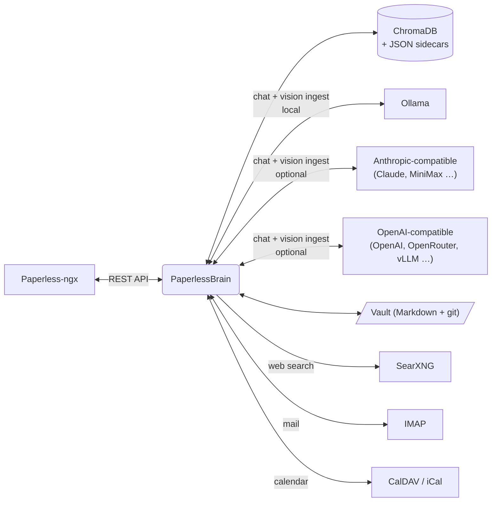

<p align="center">
  
</p>

<h1 align="center">PaperlessBrain</h1>

<p align="center"><b>The brain for your <a href="https://docs.paperless-ngx.com/">Paperless-ngx</a> archive.</b><br>
Chat with your documents, let a vision LLM read every page, never miss a deadline.<br>
Keep your Markdown notes beside them — editable in the app, Obsidian optional.<br>
Installable PWA — built for mobile and desktop.</p>

<p align="center">
  
  
  <a href="https://nicegui.io/"></a>
</p>

<p align="center">
  
</p>

---

> **Status.** A personal homelab project, shared as-is. Rough edges, no
> full-time maintainer — issues and PRs get answered when I have time, and good
> work gets merged. It's MIT: fork it if you like, but I'd rather build it with you.

## What it does

Paperless-ngx stores and organizes your documents. PaperlessBrain reads them —
every page, through a vision LLM — and turns the archive into something you can
talk to.

- **Chat with your archive** — an agentic tool loop that searches, reads,
  cross-references and cites your documents.
- **Vision-LLM ingestion** — every page rendered and read by a vision model:
  summary, tables, actions and deadlines, per document type. Fully local on
  Ollama, or any cloud vision model.
- **Deadlines & actions** — extracted obligations ("cancel by …", "pay until …")
  on the dashboard.
- **Brain memory** — the assistant remembers facts about you as plain Markdown,
  embedded for recall in every conversation.
- **Note vault** — your Markdown notes in a plain folder, searchable in chat.
  Editable in the app (tree, editor, properties panel) so a phone is enough;
  Obsidian on the same folder stays the richer way to work.
  → [docs/vault.md](docs/vault.md)
- **Voice memos** — speak, and the transcript is tidied into structured Markdown
  and filed into your vault after you approve it. Conversation mode turns a
  recorded dialog into speaker turns. → [docs/voice-memos.md](docs/voice-memos.md)
- **Deep research** — autonomous multi-step research across **your own
  documents** alongside the web. Deterministic code checks every quote against
  what the tools actually returned, so what survives is citable.
- **Document generation** — DIN-5008 letters, email drafts, chat-to-PDF saved
  back into Paperless. Plus notes filed on a document under your own account.
- **OCR write-back (opt-in)** — vision-read text pushed back into Paperless,
  which fixes its full-text search too. → [docs/operations.md](docs/operations.md)
- **Email, calendar & web** — per-user IMAP and CalDAV (encrypted), web search
  through your own SearXNG with full-page reading.
- **PWA** — installable on phone and desktop, English/German, dark/light.

## Screenshots

<table>
  <tr>
    <td width="50%"><br><sub><b>Dashboard</b> — deadlines & actions extracted from every document</sub></td>
    <td width="50%"><br><sub><b>Document detail</b> — vision-read pages, tables, actions, cross-references</sub></td>
  </tr>
  <tr>
    <td width="50%"><br><sub><b>Note vault</b> — tree, markdown editor and properties, without leaving the app</sub></td>
    <td width="50%"><br><sub><b>Chat</b> — agentic tool loop over documents, notes, mail and the web</sub></td>
  </tr>
  <tr>
    <td colspan="2"><br><sub><b>Deep research</b> — autonomous multi-step research, reviewed before persist</sub></td>
  </tr>
</table>

## Quick start (Docker)

```bash
mkdir paperless-brain && cd paperless-brain
BASE=https://raw.githubusercontent.com/Vailsen/paperless-brain/main
curl -O  $BASE/docker-compose.yml
curl -o .env $BASE/.env.example   # fill in: PAPERLESS_URL, PAPERLESS_SUPERUSER_TOKEN, STORAGE_SECRET
docker compose up -d              # pulls the prebuilt image from GHCR
```

Two files, ~6 KB — nothing to clone. Prefer a fixed tag (`v0.2.0`) over `main`.

**Before the first start**, point the **vault mount** in `docker-compose.yml` at
the directory holding your notes — one subfolder per Paperless user
(`/srv/obsidian/alice` for user `alice` → mount `- /srv/obsidian:/mnt/vaults`).
Left unchanged, the app creates an empty vault and your real notes are never
indexed.

Then open `http://localhost:8080` and log in with your **Paperless-ngx username
and password** — users, permissions and sessions come from Paperless itself.

First boot downloads the embedding model (~2.2 GB) into a Docker volume, so the
container needs internet access once. The default image includes headless
Chromium for JS-heavy pages; `:lean` is ~1 GB smaller and falls back to
trafilatura. To build from source, clone and swap `image:` for `build: .`.

Installing without Docker → [docs/operations.md](docs/operations.md).

## Prerequisites

| You need | Notes |
|---|---|
| Paperless-ngx | any recent version + a superuser API token |
| A vision-capable model | for ingestion — local via Ollama (Qwen-VL class, can live on another machine) or any cloud vision model |
| An LLM endpoint for chat | Anthropic- or OpenAI-compatible; added per user in Settings |
| SearXNG · IMAP · CalDAV · speech-to-text · WoL GPU host | all optional, each enabling one feature |

## AI models & providers

Models are added **per user** in *Settings > AI Models* — base URL, API key,
model id. Two backend types (`anthropic`, `openai_compatible`), both with a
custom base URL, so local runtimes (Ollama, vLLM, llama.cpp, LM Studio), direct
cloud providers and AI gateways (OpenRouter, Requesty, LiteLLM, Portkey) all
work with no code. No provider is hardcoded and **no API key belongs in `.env`**.
The same registry serves chat, deep research and vision ingestion.

Details, thinking mode and every `.env` key → [docs/configuration.md](docs/configuration.md).

## Architecture



Sync compares Paperless against the index; new documents are rendered page by
page and read by the vision model, landing as JSON sidecars plus ChromaDB
embeddings (`multilingual-e5`). Each run ends with removal of deleted documents,
an LLM review of extracted deadlines and — if enabled — the text write-back.
Both LLM backends share one tool set and one streaming event protocol.

## Documentation

| | |
|---|---|
| [Configuration](docs/configuration.md) | every `.env` key, model registry, extraction rules, adding a language |
| [Vault & notes](docs/vault.md) | how memory and your notes are stored, the built-in editor, Obsidian alongside it |
| [Voice memos](docs/voice-memos.md) | transcription services, conversation mode, what to expect |
| [Operations](docs/operations.md) | OCR write-back, Wake-on-LAN + idle shutdown, security notes, bare-metal install |

## Why I built this

I tried several existing tools in early 2026 and none fit: I wanted high-end
consumer hardware used properly, a more detailed LLM ingestion, an
information-rich vector database and genuinely useful document views. It grew
feature by feature until it felt worth sharing.

My best results so far come from **Qwen3.6-35B-A3B (MTP, Q4)** as the chat model
— Multi-Token Prediction makes it faster than any cloud model I've tried while
staying strong at tool use. Nothing here is tied to a specific model.

## Contributing

Issues and PRs welcome — early alpha from a personal homelab, so expect rough
edges. Please open an issue before large changes. CI runs the test suite on
every PR.

## Acknowledgements

**[NiceGUI](https://nicegui.io/)** is the entire frontend: every page, dialog
and the streaming chat view is plain Python — no JS build step, no separate
frontend service, no API layer to keep in sync. A one-person project keeps a UI
this large maintainable only because that whole category of work is gone. Thank
you, Zauberzeug.

**[Paperless-ngx](https://docs.paperless-ngx.com/)** is the archive this is built
on — it stores the documents, owns users and permissions, and is why this project
can concentrate on reading and reasoning. PaperlessBrain adds to it; it does not
replace it.

Also standing on: [FastAPI](https://fastapi.tiangolo.com/),
[ChromaDB](https://www.trychroma.com/),
[sentence-transformers](https://sbert.net/) with
[intfloat/multilingual-e5-large-instruct](https://huggingface.co/intfloat/multilingual-e5-large-instruct),
[Ollama](https://ollama.com/), [pypdfium2](https://github.com/pypdfium2-team/pypdfium2),
[WeasyPrint](https://weasyprint.org/) and [SearXNG](https://searxng.org/).

## License

[MIT](LICENSE) — use it, fork it, ship it, sell it. Attribution is the only
condition. All runtime dependencies are permissively licensed (MIT / BSD /
Apache-2.0).
