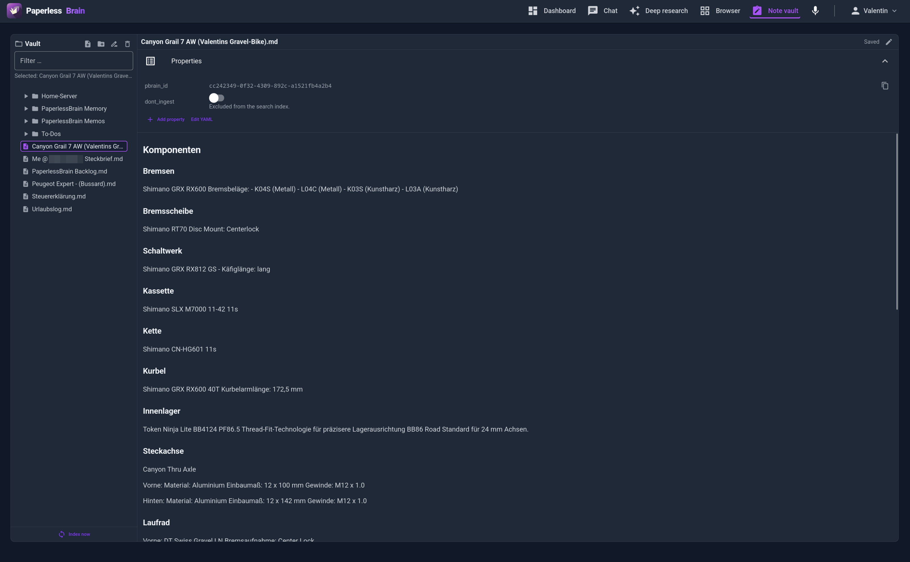

# Vault, memory and the note editor

Where the assistant's memory and your own notes live, and how the built-in
editor works alongside Obsidian. The [README](../README.md) has the overview.

## Vault & memory

The assistant's long-term memory and your personal notes live in a **plain
folder of Markdown files** — one subfolder per user under `VAULT_ROOT`:

```
vaults/
└── alice/
    ├── PaperlessBrain Memory/  ← agent-curated facts (one fact = one file)
    ├── PaperlessBrain Memos/   ← voice memos (one memo = one file)
    └── ... your notes ...      ← searchable knowledge base
```

- The folder is **git-tracked by the app itself** — change detection, sync
  bookmark and audit trail in one. You don't have to touch git.
- **Edit it in the app** — see [Note vault](#note-vault) below. No external
  editor needed, on any device.
- Optional topology for editing on other devices with a native app: point a
  WebDAV server at the same directory and sync it with Obsidian + Remotely Save.
  The WebDAV server must serve the *same* directory the app mounts — the app
  keeps the single authoritative copy.

Markdown on disk is the source of truth; ChromaDB is only the index and can
always be rebuilt from the files.

### Note vault

**Obsidian is the better editor — this one means you do not need it installed.**
The *Note vault* module edits the same folder from the browser: a tree on the
left, the note on the right, the frontmatter as typed properties above it. It
does not try to match Obsidian's plugins, graph, backlinks or live preview; it
covers writing a note, fixing a typo, changing a tag and filing something, from
whatever device is to hand. No app to install, no device to sync, no server
shell access to hand out.

<p align="center">
  
</p>

- **Read first, edit on demand** — a note opens rendered; the pencil switches to
  the markdown source in a CodeMirror editor with syntax highlighting.
- **Properties, not raw YAML** — tags as chips, `dont_ingest` as a switch, dates
  and text as fields, plus add/remove and an "Edit YAML" escape hatch for the
  exotic cases. Untouched keys are written back **byte for byte**: your comments,
  key order and date formatting survive editing, because the editor splices only
  the keys you changed instead of re-serializing the block.
- **Autosave, no save button** — a couple of seconds after you stop typing.
- **Create, rename, move, delete** notes and folders. Attachments (PDFs, images)
  show in the tree and open read-only.
- **Nothing is lost if you edit in two places.** Every save compares a hash of
  the file on disk; if Obsidian, another tab or the indexer changed it
  meanwhile, the two versions are merged when they touch different parts, and
  only a real overlap raises a conflict banner with a diff and an explicit
  choice. Delete or rename a note elsewhere and the open editor notices — it can
  even follow a moved note by its id.
- **Indexing is deferred on purpose** — editing writes files only; the next chat
  message (or the *Index now* button) embeds what changed and commits it in one
  go. A dot marks notes that are written but not yet searchable. That is why an
  editing session costs one git commit instead of one per keystroke.
- **Obsidian still works** on the same folder, at the same time, and stays the
  richer way to work with a large vault. The app writes ordinary Markdown with a
  small YAML frontmatter, atomically, and treats the files as the source of
  truth — the built-in editor is one more client, never a competing format.

The assistant can **read** these notes (`vault_search`) but never write them.
Only you edit your notes; the agent curates only its own memory folder.
